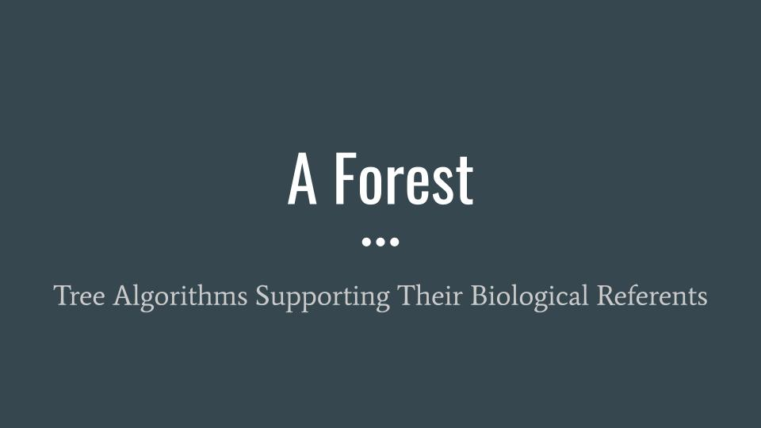

# Forest_Cover_Prediction

Thank you for your interest in this project 🙂

We have worked on the data of the Roosevelt Forest in Colorado.

Being able to anticipate what type of vegetation is going to grow in a forest is necessary to address different problems:

- fire prevention
- pest control
- forest management
- distribution of resources

We have studied the problem, and we think that from Machine Learning we can contribute to the health of forests.

## Source:

https://archive.ics.uci.edu/ml/datasets/covertype

### I've perform the following tasks:

1. EDA
https://github.com/irene-glez/Forest_Cover_Prediction/blob/main/src/notebooks/1.EDA.ipynb

2. Feature Engineering
https://github.com/irene-glez/Forest_Cover_Prediction/blob/main/src/notebooks/2.feature_engineering.ipynb

3. Model selection and fitting
https://github.com/irene-glez/Forest_Cover_Prediction/blob/main/src/notebooks/3.model_selection.ipynb

4. Model interpretation
https://github.com/irene-glez/Forest_Cover_Prediction/blob/main/src/notebooks/4.model_interpretation.ipynb

5. Script to train and save the model
https://github.com/irene-glez/Forest_Cover_Prediction/blob/main/main.py

